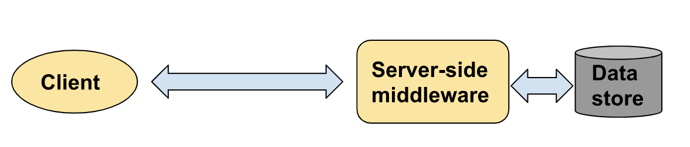

# Consistent Distributed Key-Value Store #

## 1. Overview ##

**Goals**: The main goals of this assignment are to learn 

1. how to build a distributed data storage system with consistency requirements;
2. to work with a popular, widely used key-value data store.

**Parts**: You will implement a simple distributed data storage system using a so-called NoSQL key-value system, Cassandra, in two progressive parts:

1. Part 1: A single-node data store wrapper based on Cassandra and a non-blocking client;
2. Part 2: A distributed wrapper (or middleware) to ensure totally ordered writes on servers; 

Note that Cassandra itself has powerful distribution and consistency capabilities, but in this assignment, you will use Cassandra as a simple, single-node storage system and you will yourself implement the distributed coordination features in your server-side middleware as illustrated in the figure below (and detailed in Section 3).

                                    

You need to implement the following two programs (shown in yellow) in the figure above: 

1. A server-side distributed middleware that uses Cassandra as a back-end data store; 
2. A client that interoperates with your distributed middleware. 

## 2. Preparation ##

You will need to complete the following steps before you can get started on the assignment.

* **Step 1**: Check out the git repository for 578 using the following shell command:
    ~~`git clone git@bitbucket.org:distrsys/consistent-db.git`~~
    `git clone https://avenka@bitbucket.org/distrsys/consistent-db.git`

* **Step 2**: You need Java 8 or higher on your machine for the assignment code provided. You may need a higher minor or major version number depending on the Cassandra version you use.

* **Step 3**: Complete the Cassandra [Getting Started tutorial](https://docs.google.com/document/d/1pt2GrLv4P-JtvASM0tpqQhf1f58vNtDHagDc2Uef9CY/edit?usp=sharing). By the end of the tutorial, you should know how to write a Java client to create a keyspace, create a table, insert some records, read records, delete records, etc.

## 3. Assignment Activities ##

The assignment has been broken down into two progressive parts with separate deadlines, the second building upon the first one. This organization is so that first part is relatively simple and acts as a forcing function for you to complete the “getting started” assignment activities in a timely manner; otherwise students tend to start from scratch on the entire assignment close to the submission deadline and end up getting overwhelmed. 

Have you completed all the steps in the Preparation section just above? If not, go back to the previous section. Else proceed with Part 1 below.

### 3.1 [Part 1]: Single-node data store wrapper ###

This part does not involve any distribution, but simply involves familiarizing ourselves with template code using a non-blocking I/O library and using it to implement a request/response server-side wrapper for Cassandra.

You are given a simple client and a single-node server using non-blocking IO respectively at
* client.Client.java
* server.SingleServer.java

`Client` sends requests to and processes responses from `SingleServer`. You need to extend the template code therein so that `SingleServer` dispatches requests received from `Client` to the local Cassandra instance and sends responses back to that Client. To this end, proceed in the following steps:

1. Compile the client and server by including jars in lib/ as needed in your classpath:

    `javac -cp ./lib/cassandra-driver-core-3.0.1-shaded.jar:./lib/nio-1.2.1.jar src/client/Client.java src/server/SingleServer.java`

    The `javac` command is for clarity of what libraries are needed in the classpath. You are strongly encouraged to use an IDE and if so, you won’t actually need to type the above command.

2. Run the server first followed then by the client. You should see the client print `hello`. You can supply an optional (but identical) `IP:port` as an argument to both to specify non-default socket addresses. For clarity, the command-line argument to run the server is

    `java -cp ./lib/cassandra-driver-core-3.0.1-shaded.jar:./lib/nio-1.2.1.jar:<path/to/server/class/files> server.SingleServer`

3. Study the `Client` and `SingleServer` code and documentation (well under 100 lines). The default server behavior is simply to echo back whatever the client sent it. Observe that `Client.send` is the non-blocking method to send a request to the server and `Client.handleResponse` is used to process responses back from the server. Non-blocking means that the send will return immediately and the default callback method `handleResponse` will automatically get called whenever in the future any message is received from the server.

4. Start a Cassandra instance on localhost on the same machine as the server. 

5. Your goal is to make the `junit` tests in `GraderSingleServer.java` in the `test/` directory pass. To this end, you need to write a client `MyDBClient.java` extending `Client.java` and a server `MyDBSingleServer.java` that satisfy the following design requirements:

    1. The client should be able to continue to send requests as a `String` to the server and have the server execute them on the local Cassandra instance.
    2. The server should send some response back to the client when the operation is complete. It is not important to parse the request or the structure of the response.
    3. The server should connect to a keyspace name provided in its constructor.
    4. `MyDBClient.java` should extend `Client.java` and `MyDBSingleServer.java` should extend `SingleServer.java` as indicated.
    5. The classes `Client.java` and `SingleServer.java` can not be modified. As a consequence, the final method `Client.send` can also not be modified.
    6. The method `Client.callbackSend` is the key method you need to override and it should, as documented, invoke the callback upon (and only upon) completing the execution of the request it previously sent to the server. 
    
Note that the simple `Client.send` is non-blocking and is the only way to send requests to the server, and `Client.handleResponse` is the only place it receives responses. So if you call the supplied callback immediately after sending the request in callbackSend, that would be incorrect. You need to implement logic to match a received response with the corresponding previously sent request. For example, you could include a unique request identifier in each request and its corresponding response in order to match the two.

**Tips**

1. You should be able to test-drive all supplied classes including `Grader*` by simply running them using their main methods.
2. The documentation of the `edu.umass.cs.nio` library being used is included in the provided source jar. It does indeed ensure reliable, in-order message delivery so that you don’t have to worry about networking issues.
3. While testing, make sure you create any keyspace as needed on your local Cassandra instance before running `Grader*`.

### 3.2. [Part 2]: Distributed middleware for totally ordered writes ###

This part requires you to implement `MyDBReplicatedServer.java` that extends `SingleServer.java` (*NOT* `ReplicatedServer.java`) satisfying the following design requirements:

1. Upon receiving a request, `MyDBReplicatedServer.java` should coordinate with other servers as needed in order to implement totally ordered update operations.
2. Your goal as before is to make the junit tests in Grader pass. 

Your code must respect the following constraints and testing assumptions:

1. As before, you can not modify `Client.java` and `SingleServer.java`. 
2. The only Cassandra write operations with which we will test are `create, insert, update, drop, and truncate`.
3. The `Grader` will only send requests from a single client instance (but the non-blocking API means that concurrent requests will inevitably get dispatched).
4. Do not use `sleep` in your client or server code. That would be "cheating" because, as you can see from the Grader's tests, it's ability to blast requests quickly is important to stress test your code.
5. Do not use any global data structures (i.e., static variables) because a global data structure doesn't exist in a distributed system (but exists in our single-JVM testing environment.)
 

Tip: Use `ReplicatedServer.java` as a starting point, noting that it only implements a simplistic lazy replication approach that may not even be eventually consistent.

Additional tips [here](tips.md).

## 4. Submission instructions ##
You need to submit the following retaining the original directory structure.

1. `MyDBClient.java` (for part 1 by its due date on Gradescope)
2. `MyDBSingleServer.java` (for part 1 by its due date on Gradescope)
3. `MyDBReplicatedServer.java` (for part 2 by its due date on Gradescope)
4. Each part’s submission must be accompanied by a brief design document (at most two pages) explaining your approach including what you tried even if your submission didn’t pass all tests or work at all. Part 1 should not require more than a paragraph or two to describe your approach.

